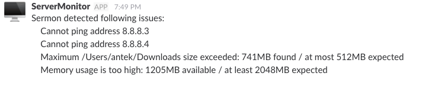

# Sermon

> Sermon is simple server monitoring script with email and slack notifications.

## Usage

In order to use Sermon, you need to place configuration file in your `$HOME` directory. File should be called `.sermon.yml` and it can be
generated automatically using following command:
```bash
$ sermon --setup
```
Attributes which can be defined in configuration file are following:
* `ping` - gets list of addresses to ping in order to check connection.
* `free_space` - gets collection of key/value entries. Keys are directories path and values expresses maximum value of space (in MB).
* `free_mem` - gets maximal memory usage (in MB).
* `emails` - gets list of emails. When one or more checks fail, notifications will be send on those email addresses.
* `slack` - gets `webhook_url` and `channel` to which notification will be send. `webhook_url` parameter is required, while `channel` is optional.


## How does it work?

In simple steps, sermon performs following actions:
1. Reads configuration file.
2. Performs some basic validations (e.g. at least one communication channel - slack or email - must be defined).
3. If validation is successful - creates notifying and measuring objects and places them in specific registers.
4. Loads notifying and measuring objects from registry.
5. Performs checks and collects errors.
6. Sends notifications if any error was found.




## Contributing

Bug reports and pull requests are welcome on GitHub at https://github.com/musztardem/sermon.


## License

The gem is available as open source under the terms of the [MIT License](http://opensource.org/licenses/MIT).

